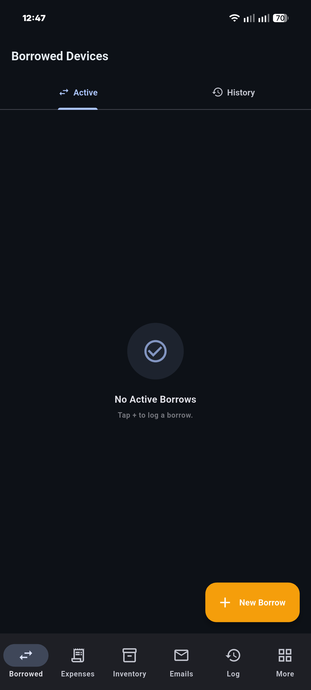
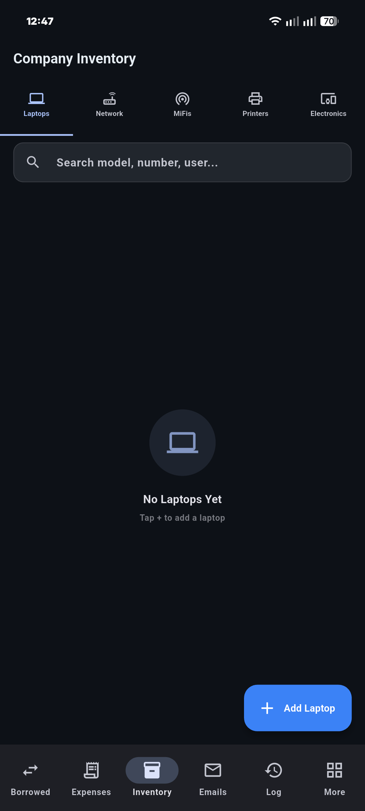
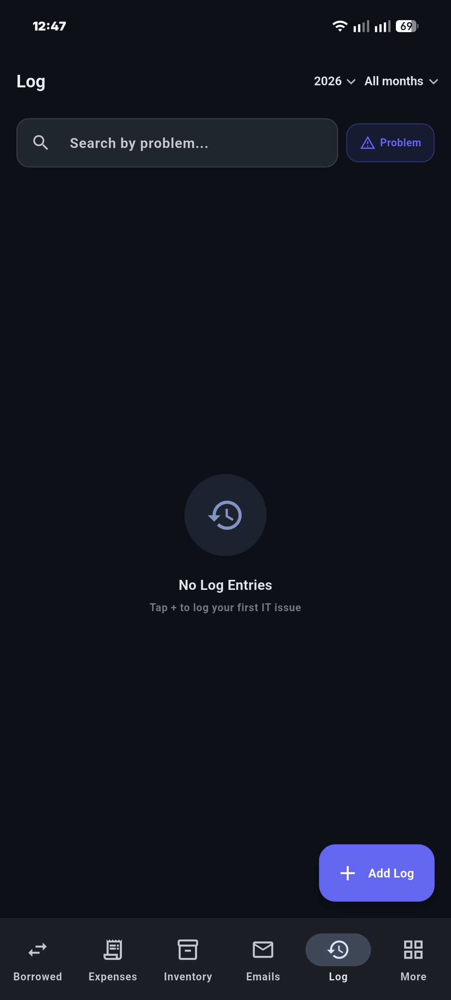
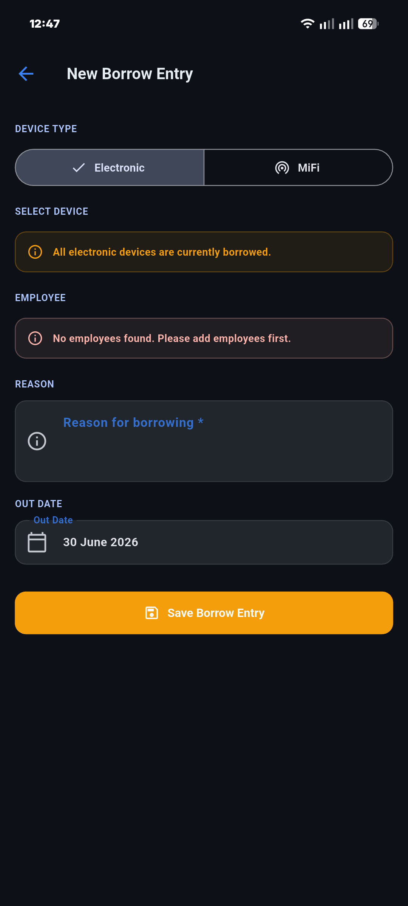
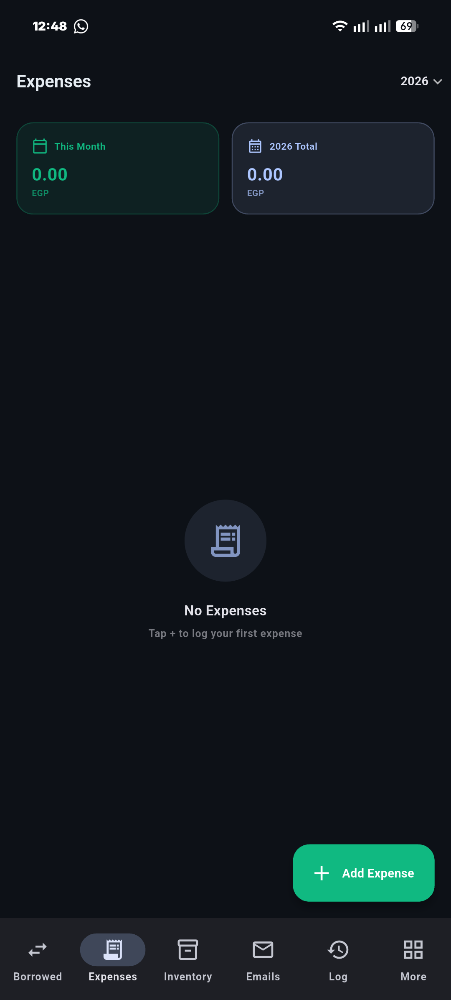
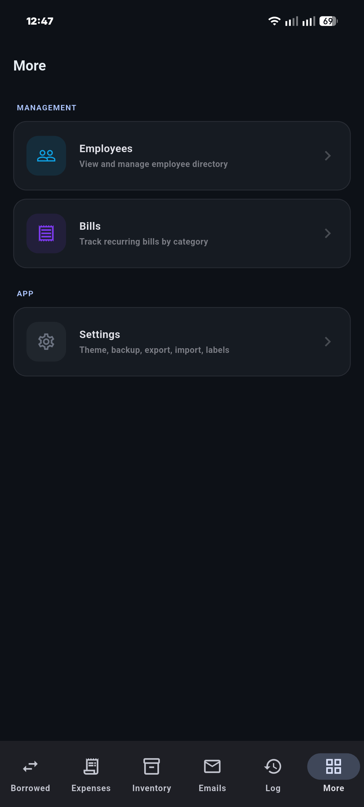

<div align="center">


# IT Box

### Your offline IT department inventory, all in one place

[](https://flutter.dev)
[](https://dart.dev)
[](https://android.com)
[](https://github.com/mina-android/ITbox/releases)
[](LICENSE)

**IT Box** is a clean, fast, and fully offline inventory management app for IT departments, built with Flutter.  
No accounts. No cloud. No ads. Everything lives on your device — always.

[**Download APK**](#installation) · [**Features**](#features) · [**Screenshots**](#screenshots) · [**Build It**](#building-from-source)

</div>

---

## Why IT Box?

Most inventory tools are web-based, require logins, or sync to the cloud. IT Box does none of that. It stores everything locally using SQLite, works completely offline, and is designed specifically for the day-to-day needs of IT staff: tracking devices, logging issues, managing borrowed equipment, recording expenses, and more — all from a single Android app.

---

## Features

### 📦 Inventory
- Track **Laptops**, **Network Devices**, **MiFis**, **Printers**, and **Electronics** across 5 sub-tabs
- **Laptops** — full specs (CPU, GPU, RAM, Storage), condition, and assigned employee
- **Network Devices** — routers with WiFi name, WiFi password, gateway, and admin credentials
- **MiFis** — mobile WiFi devices with quota, service provider, and full credential set
- **Printers** — condition and location tracking
- **Electronics** — general devices with borrow status
- Tap to view details, edit inline, or delete with confirmation

### 🔄 Borrowed Devices
- Track which **Electronics** and **MiFis** are borrowed, by whom, and when
- Split into **Active** and **History** tabs
- Assign borrowing to any employee with a reason and out-date
- Mark as returned to close the borrow log
- Device status (Available / Borrowed) syncs automatically across Inventory screens

### 💸 Expenses
- Log expenses with date, item name, price, and optional details
- Grouped by **month** with a running total per month
- **Yearly filter** in the AppBar to jump between years
- All values displayed in **EGP**
- Export a custom date range to **Excel (.xlsx)**

### 🏷️ Bills
- Track recurring bills by category: MiFis, 4G Internet, Landline Internet, Landline Phone, Mobile Phone
- Fields: person, number, price, and optional notes
- No date column — designed for steady recurring entries, not one-off payments

### 📧 Emails
- Email accounts linked to employees
- Show/hide **password toggle** per entry
- Quick reference for shared or service accounts

### 🪵 Log *(bottom bar tab)*
- Log IT issues with **Date**, **User** (employee dropdown), **Problem**, and **Solution**
- Entries grouped by **month**
- **Year and month filters** in the AppBar to narrow down the view
- **Search by problem** or **search by employee** — toggle between modes with one tap
- Add, edit, and delete log entries; empty solution field shows "No solution yet" badge
- Full **backup and export** coverage

### 👥 Employees
- Central employee directory used across the whole app (Laptops, Borrowed, Log, Emails)
- Add, edit, and delete employees
- Accessible from the **More** tab

### 📊 More Tab
- Hub screen for **Employees**, **Bills**, and **Settings**
- Card-style navigation with section grouping

### ⚙️ Settings

- **Dark mode** toggle — on by default, persisted between sessions
- **Company name** — set on first launch (onboarding), editable anytime; shown in the Inventory tab header
- **Backup** — full JSON export of every table; save anywhere via the Android file picker (SAF)
- **Restore** — import from any `.json` backup file
- **Export** — export any category (Laptops, Network Devices, MiFis, Printers, Electronics, Employees, Bills, Emails, Expenses, Log) to Excel (.xlsx)
- **Import** — import from Excel with **Append or Replace** mode for all categories
- **Label PDF** — generate a 3-column device label sheet for any category; saved to temp dir and shared via the system share sheet
- Live **backup item counts** before exporting (all tables including Log)

### 🖨️ App Icon
- Blue IT toolbox illustration
- **Adaptive icon** — correct shape on all Android launchers (circle, squircle, rounded square, square)
- **Themed icon (Android 13+)** — monochrome silhouette recoloured to match your wallpaper palette
- Notification icon at all screen densities (mdpi → xxxhdpi)

---

## Screenshots

> Place your screenshots in `screenshots/` with the filenames below.

| Home | Inventory | Log |
|------|-----------|-----|
|  |  |  |

| Borrowed | Expenses | More |
|----------|----------|------|
|  |  |  |

---

## Project Structure

```
lib/
├── main.dart                        # App entry point, theme wiring, onboarding check
├── theme/
│   └── app_theme.dart               # Material You light & dark themes
├── models/                          # Pure data classes (no Flutter dependency)
│   ├── laptop.dart
│   ├── network_device.dart
│   ├── mifi.dart
│   ├── printer.dart
│   ├── electronic.dart
│   ├── employee.dart
│   ├── borrow_log.dart
│   ├── expense.dart
│   ├── bill.dart
│   ├── email_account.dart
│   └── log_entry.dart
├── database/
│   └── database_helper.dart         # Singleton SQLite helper (sqflite), schema v6
├── services/
│   ├── theme_service.dart           # Dark/light mode, SharedPreferences, singleton
│   ├── company_service.dart         # Company name persistence, onboarding flag
│   ├── excel_service.dart           # Excel export via excel package + share_plus
│   ├── excel_import_service.dart    # Excel import with Append/Replace, per-row error reporting
│   └── label_service.dart           # PDF label generation via pdf package
├── widgets/
│   └── common_widgets.dart          # StatusBadge, ConditionBadge, IconBox, EmptyState,
│                                    # SearchBar2, DetailRow, SectionLabel,
│                                    # showConfirmDialog, showSnack
└── screens/
    ├── home_screen.dart             # Root: 6-tab NavigationBar
    ├── more_screen.dart             # More hub: Employees, Bills, Settings
    ├── onboarding/                  # First-launch company name screen
    ├── inventory/                   # 5-tab TabBar host (Laptops→Electronics)
    ├── laptops/
    ├── network_devices/
    ├── mifis/
    ├── printers/
    ├── electronics/
    ├── employees/
    ├── borrowed/
    ├── expenses/
    ├── bills/
    ├── emails/
    ├── logs/                        # Log tab — LogsScreen + LogFormScreen
    └── settings/                    # Settings, label export
```

---

## Building from Source

### Prerequisites

| Tool | Version | Download |
|------|---------|---------|
| Flutter SDK | 3.3+ | [flutter.dev](https://flutter.dev/docs/get-started/install) |
| Android Studio | Latest | [developer.android.com/studio](https://developer.android.com/studio) |
| Java JDK | 17+ | [adoptium.net](https://adoptium.net/) |

```bash
flutter doctor
```

### Steps

```bash
# 1. Clone
git clone https://github.com/mina-android/ITbox.git
cd ITbox

# 2. Install dependencies
flutter pub get

# 3. Run in development
flutter run

# 4. Build release APK
flutter build apk --release

# Split by CPU architecture (smaller files, recommended)
flutter build apk --split-per-abi --release
```

Output: `build/app/outputs/flutter-apk/app-arm64-v8a-release.apk`

---

## Installation

1. Go to [**Releases**](https://github.com/mina-android/ITbox/releases)
2. Download `app-release.apk`
3. On your phone: **Settings → Security → Install Unknown Apps** → enable for your file manager
4. Open the APK and install

> Minimum Android: **12 (API 31)**

---

## Gradle / Build Config

| Component | Version |
|-----------|---------|
| Gradle | **8.9** |
| Android Gradle Plugin | **8.6.0** |
| Kotlin JVM Target | 17 |
| Java | 17 |
| Package | `com.ma.itbox` |
| Min SDK | 31 (Android 12) |
| Target SDK | 36 |
| Compile SDK | 36 |
| NDK | 28.2.13676358 |

---

## Database Schema

SQLite database (`itbox.db`), **version 6**.

| Table | Key Columns |
|-------|-------------|
| `laptops` | laptop_number, model, cpu, gpu, ram, storage, condition, user, password |
| `network_devices` | device_number, model, phone_number, device_location, service_provider, wifi_name, wifi_password, gateway, admin_password, status |
| `mifis` | device_number, model, phone_number, wifi_name, wifi_password, quota, service_provider, gateway, admin_password, status |
| `printers` | printer_number, model, condition, location |
| `electronics` | device_number, device_name, details, status |
| `employees` | name, phone_number |
| `borrow_logs` | device_type ('electronic'\|'mifi'), device_id, device_name, device_number, employee_id, employee_name, reason, out_date, back_date, is_returned |
| `expenses` | date (yyyy-MM-dd), item, price (REAL), details |
| `bills` | person, number, category, price (REAL), notes |
| `email_accounts` | employee_id, employee_name, email, password |
| `log_entries` | date (yyyy-MM-dd), employee_id, employee_name, problem, solution |

Migration history: v1→v2 (network_devices rebuild) · v2→v3 (mifis.status) · v3→v4 (bills, email_accounts) · v4→v5 (bills date removed) · v5→v6 (log_entries added)

---

## Android Permissions

| Permission | Purpose |
|-----------|---------|
| `READ_EXTERNAL_STORAGE` | File picker on Android ≤ 12 |
| `WRITE_EXTERNAL_STORAGE` | File save on Android ≤ 9 |
| `READ_MEDIA_IMAGES` | File picker on Android 13+ |

IT Box requests no network permissions — all data is local and all exports go through the system file picker.

---

## Dependencies

| Package | Purpose |
|---------|---------|
| `sqflite` | Local SQLite database |
| `path_provider` | App directory paths |
| `path` | Path utilities |
| `intl` | Date & number formatting |
| `share_plus` | Share files via system sheet |
| `file_picker` | Open/save file dialogs |
| `pdf` | PDF label generation |
| `excel` | Excel (.xlsx) export & import |
| `shared_preferences` | Theme & company name persistence |

---

## Data & Privacy

- ✅ All data stored locally in SQLite — never leaves your device
- ✅ No network requests of any kind
- ✅ No analytics, no crash reporting, no telemetry
- ✅ No ads
- ✅ Backup is a plain JSON file you fully control
- ✅ Uninstalling deletes all data — nothing left behind

---

## Troubleshooting

**`flutter pub get` fails**
```bash
flutter clean && flutter pub get
```

**Accept Android SDK licenses**
```bash
flutter doctor --android-licenses
```

**Items not showing after adding**  
Every list screen manages its own Scaffold + FAB. If you're adding a new screen, follow the same pattern — `setState` inside the screen's own `_load()` call after returning from the form.

**Bills screen stuck on loading**  
The `bills` table has no `date` column (removed in DB v5). Never use `ORDER BY date DESC` in `getBills()` — use `ORDER BY id DESC` instead.

---

## .gitignore

```gitignore
.dart_tool/
.flutter-plugins
.flutter-plugins-dependencies
.packages
.pub-cache/
.pub/
build/
*.iml
android/.gradle/
android/local.properties
android/key.properties
*.jks
*.keystore
.idea/
.vscode/
.DS_Store
```

---

## Roadmap

- [x] Inventory management (Laptops, Network, MiFis, Printers, Electronics)
- [x] Borrow tracking for Electronics and MiFis
- [x] Expenses with yearly filter and Excel export
- [x] Bills and Email accounts
- [x] JSON Backup & Restore
- [x] Excel Export & Import (all categories)
- [x] Label PDF generation
- [x] IT Issue Log with search and month/year filtering
- [ ] iOS support
- [ ] Multiple languages / localisation
- [ ] Log export to PDF
- [ ] Home screen widget (device count summary)

---

## Contributing

1. Fork the repository
2. Create a branch: `git checkout -b feature/my-feature`
3. Commit: `git commit -m "Add my feature"`
4. Push: `git push origin feature/my-feature`
5. Open a Pull Request

Code style: no `withOpacity()` (use `withValues(alpha:)`), `enableSuggestions: false` on all `TextFormField`s, `InputDecorator + DropdownButton` instead of `DropdownButtonFormField`, always `if (!mounted) return` after `await`, `flutter analyze` must pass.

---

## License

MIT License — see [LICENSE](LICENSE) for full text.  
Copyright © 2026 [Mina Android](https://github.com/mina-android)

---

<div align="center">

Made with ❤️ and Flutter · [**More projects by Mina Android**](https://github.com/mina-android) · [**⬆ Back to top**](#it-box)

</div>
