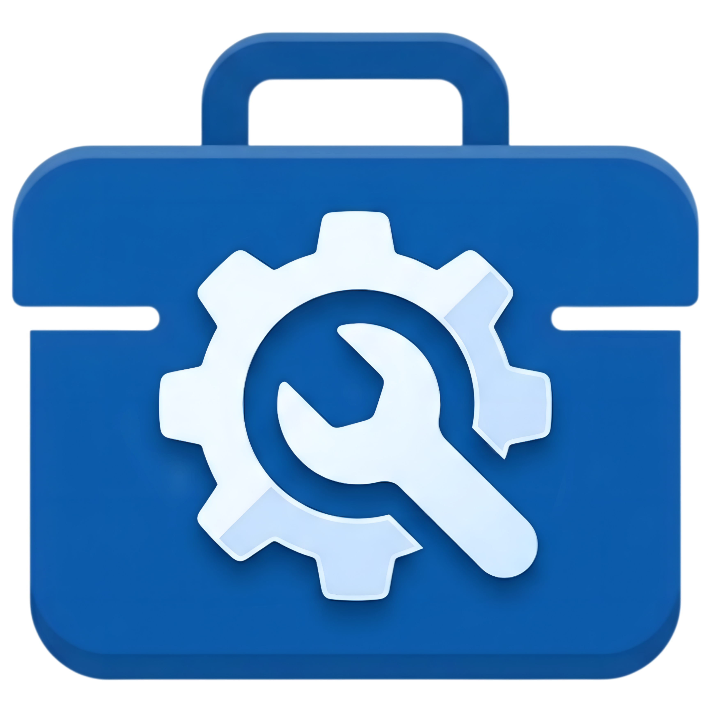
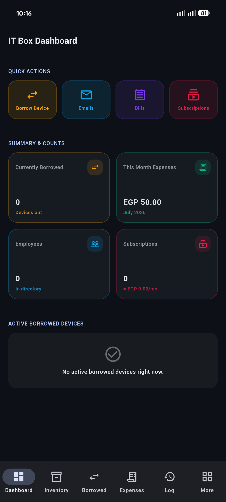
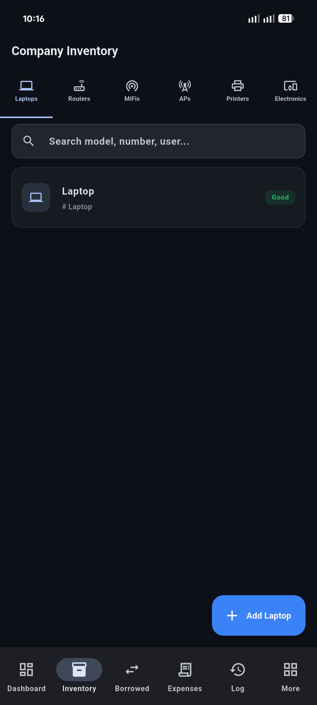
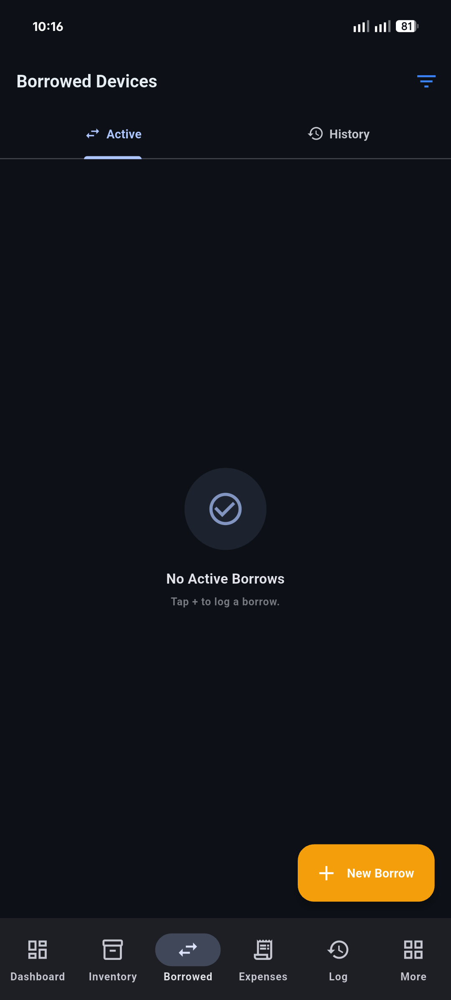
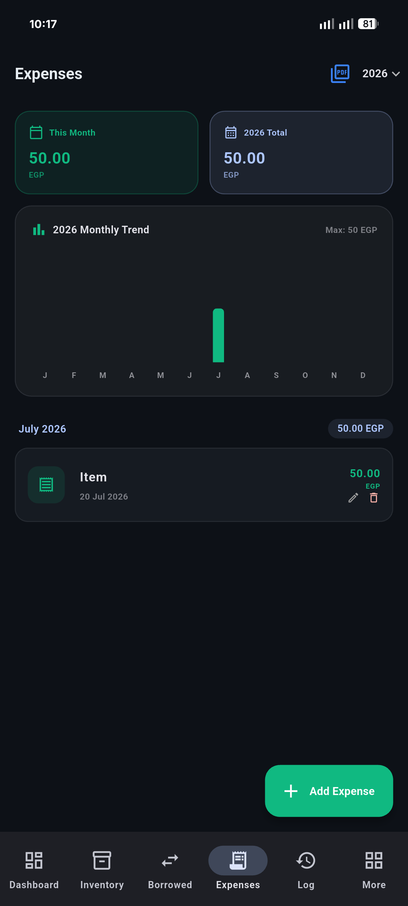
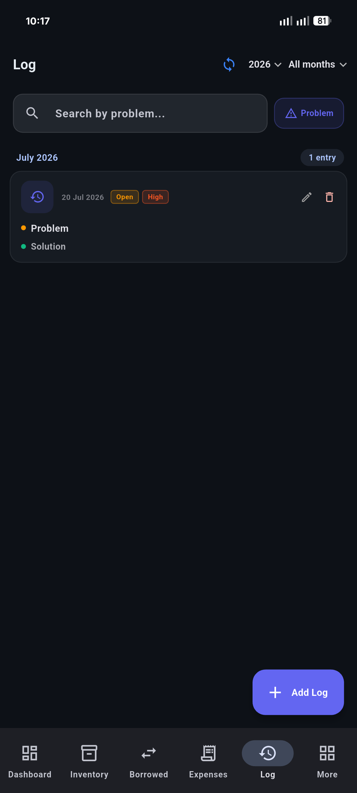
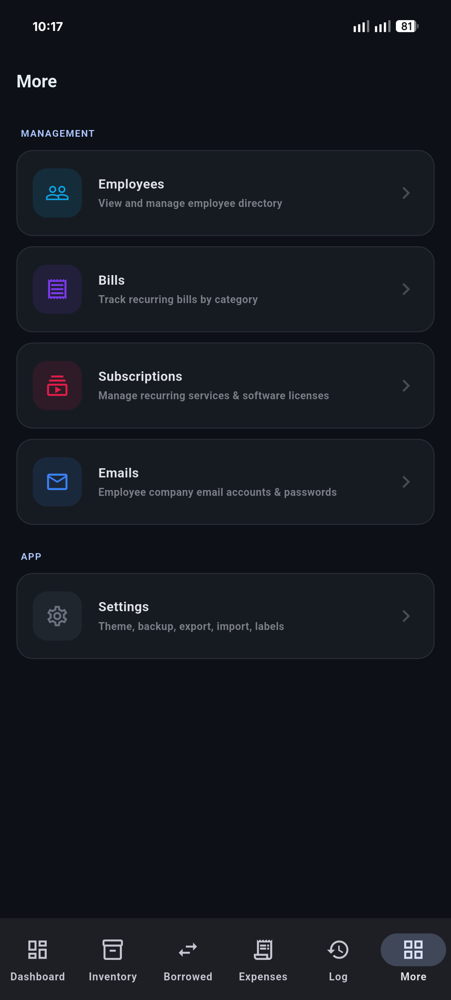

<div align="center">



# IT Box

### Your offline IT department inventory & operations hub, all in one place

[](https://flutter.dev)
[](https://android.com)
[](https://github.com/mina-android/IT-Box/releases)
[](LICENSE)

**IT Box** is a clean, lightning-fast, and 100% offline IT operations management app built with Flutter.  
No cloud sync. No subscription logins. No ads. Everything lives securely on your device — always.

[**Download**](#-installation) · [**Features**](#-features) · [**Screenshots**](#-screenshots) · [**Build from Source**](#-build-from-source)

</div>

---

## Why IT Box?

Most inventory and IT management tools are clunky web portals that require recurring subscriptions, complex cloud setups, or continuous network connectivity. **IT Box** does none of that. It stores everything locally using high-performance SQLite, operates completely offline, and is tailored specifically for the day-to-day workflow of IT administrators: tracking hardware assets, managing borrowed equipment with automated overdue alarms, logging department expenses, recording recurring software subscriptions, and generating instant PDF/Excel executive reports — all from a single, beautifully designed Android application.

---

## ✨ Features

- **📊 Interactive Dashboard (`tab [0]`)** — Landing overview with real-time operational metrics (active borrowed count, monthly EGP expense totals, employees headcount), a 4-button quick action grid (`Borrow Device`, `Emails`, `Bills`, `Subscriptions`), and interactive `fl_chart` trend graphs.
- **📦 Hardware Inventory (`tab [1]`)** — Track and manage **Laptops** (CPU/GPU/RAM specs & assigned employee), **Routers** (network devices with WiFi & admin credentials), **MiFis** (data quotas & SIM details), **Access Points (APs)** (port assignments & physical locations), **Printers**, and general **Electronics** across 6 instant sub-tabs with edge-to-edge equal spacing (`isScrollable: false`).
- **🔄 Borrowed Devices & Overdue Alarms (`tab [2]`)** — Track checkout logs for electronics and MiFis across Active and History tabs. Includes optional **Due Dates**, automatic local Android background notifications when items become overdue, red **OVERDUE** visual badges, and self-healing status synchronization (`syncDeviceStatuses`).
- **💸 Expenses & PDF Executive Reports (`tab [3]`)** — Log department purchases with running monthly totals and yearly filters in **EGP**. Export custom date ranges to **Excel (`.xlsx`)** or generate multi-page **PDF Summary Reports** with automatic subtotals.
- **🪵 IT Issue Logs (`tab [4]`)** — Record IT problems and solutions linked to employees with date pickers, monthly grouping, and one-tap problem/employee search.
- **📱 More Management Hub (`tab [5]`)** — Centralized hub to manage **Employees**, recurring **Bills**, software **Subscriptions**, employee **Email Accounts** (with 1-tap Email & Password clipboard copy), and comprehensive app **Settings**.
- **🎟️ Subscriptions Tracking Module** — Dedicated manager for SaaS licenses, cloud hosting, and service renewals with cycle filtering (`All`, `Yearly`, `Monthly`, `Weekly`) and real-time total expenditure breakdowns.
- **🚀 Guided Onboarding & Full Interoperability** — Initial setup screen lets new users **Start Fresh** or **Restore Backup (`.json`)** instantly. Import from and export to Excel (`.xlsx`) with Append or Replace modes across all categories, with company name persistence.
- **🖨️ Barcode / Device Label Generator** — Generate professional 3-column device label sheets (`.pdf`) for any category and print or share directly from your device.
- **🎨 Material You & Pixel-Perfect 100% Full-Bleed Icons** — Equipped with a prominent **100% full-bleed colored adaptive app icon** alongside a meticulously scaled **monochrome themed icon** supporting Android 13+ dynamic wallpaper tinting without edge clipping.

---

## 📸 Screenshots

<p align="center">
  
   
  
</p>

<p align="center">
  
  
  
</p>

---

## 📲 Installation

1. Go to [**Releases**](https://github.com/mina-android/IT-Box/releases)
2. Download the split APK matching your device architecture (`app-arm64-v8a-release.apk` for modern 64-bit phones, `app-armeabi-v7a-release.apk` for 32-bit devices, or `app-x86_64-release.apk` for emulators/WSA)
3. Enable **Install from unknown sources** on your Android device when prompted
4. Open the APK file and install

> Requires **Android 8.0 (API 26)** or higher.

---

## 🛠 Build from Source

**Prerequisites:** Flutter SDK (`^3.19.0` or higher), Dart SDK (`^3.3.0`), Android Studio / Android SDK (`API 34`), and JDK 17+.

```bash
# Clone the repository
git clone https://github.com/mina-android/IT-Box.git
cd IT-Box

# Fetch Flutter dependencies
flutter pub get

# Run on a connected device or emulator
flutter run

# Build split release APKs (~30 MB per architecture)
flutter build apk --split-per-abi
```

Output lands in `build/app/outputs/flutter-apk/`:
- `app-arm64-v8a-release.apk`
- `app-armeabi-v7a-release.apk`
- `app-x86_64-release.apk`

<details>
<summary><strong>Build troubleshooting & stability notes</strong></summary>

- **JVM OutOfMemoryError / EXCEPTION_ACCESS_VIOLATION during Gradle build:** This project is pre-configured in `android/gradle.properties` with `-Xmx3072m -XX:+UseParallelGC` to guarantee stability and prevent OpenJDK/JBR 21 G1 GC memory access crashes on Windows.
- **Missing local assets:** Ensure `assets/icon/app_icon.png` exists before running asset builds.
- **Cleaning lingering build artifacts:** If you encounter unexpected cache lockups, run `cd android && ./gradlew --stop && ./gradlew clean` (or `.\gradlew.bat --stop` on Windows).

</details>

---

## 🔒 Privacy

- **All data stored locally** — your SQLite database (`itbox.db`) never leaves your device
- **Zero network calls** — the app operates 100% offline without telemetry or tracking APIs
- **No analytics, no crash reporting, no ads** — complete digital sovereignty
- **Uninstalling deletes everything** — unless you manually export a `.json` or `.xlsx` backup to your device storage

---

## 🗺 Roadmap

- [x] Launch full offline inventory tracking (`Laptops`, `Routers`, `MiFis`, `APs`, `Printers`, `Electronics`)
- [x] Integrate recurring `Bills` and employee `Email Accounts` tracking
- [x] Add `Log` tab for IT department troubleshooting & problem resolution
- [x] Add interactive `Dashboard` with summary metrics, `fl_chart` graphs, and side navigation `AppDrawer`
- [x] Add `Subscriptions` module (`Yearly`, `Monthly`, `Weekly`) with real-time expenditure calculations
- [x] Integrate `flutter_local_notifications` (`v21`) for automatic overdue borrowed device reminders
- [x] Implement multi-page `PDF` Executive Expense & Bills Summary Reports alongside Excel (`.xlsx`) export
- [x] Polish 100% full-bleed colored adaptive app icons & Material You monochrome themed icons
- [ ] Add encrypted password vault protection for sensitive network/admin credentials
- [ ] Add custom tagging and asset barcode generation (`Code128` / `QR`) for physical label printing

---

## 🤝 Contributing

1. Fork the repo
2. Create a feature branch: `git checkout -b feature/my-new-feature`
3. Commit and push your changes: `git commit -m 'Add some feature' && git push origin feature/my-new-feature`
4. Open a Pull Request

*Please ensure code adheres to standard Flutter/Dart lint formatting (`flutter analyze`) and preserves existing architectural patterns (`setState + async/await`, no external state management frameworks).*

---

## License

MIT License — see [LICENSE](LICENSE) for details.  
Copyright © 2026 [Mina](https://github.com/mina-android)

<div align="center">

Made with ❤️ for IT Professionals · [**More projects**](https://github.com/mina-android)

</div>
